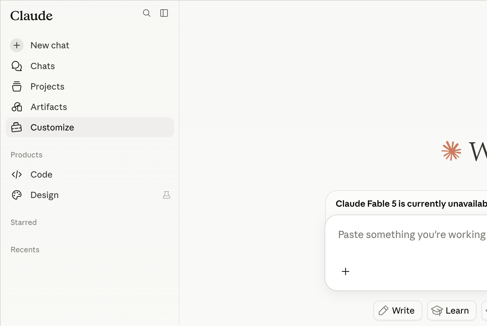
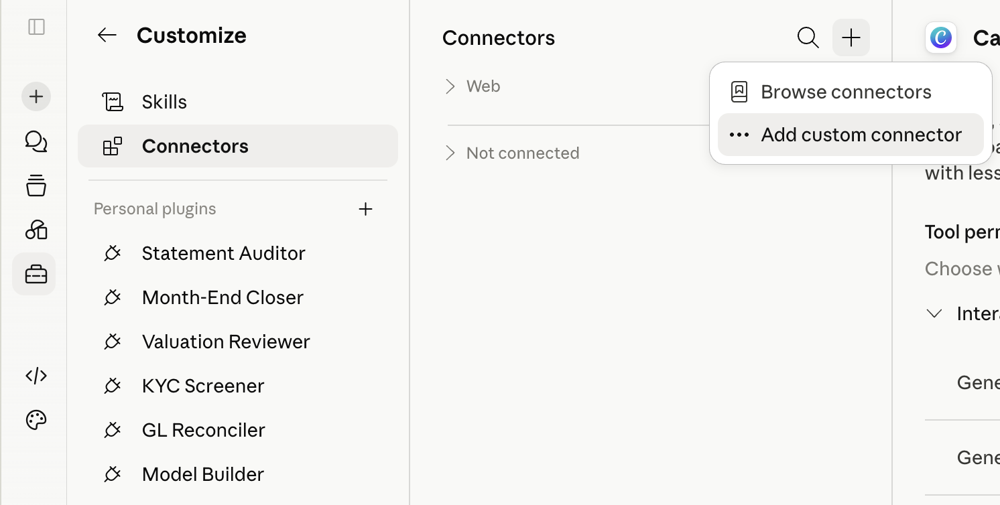
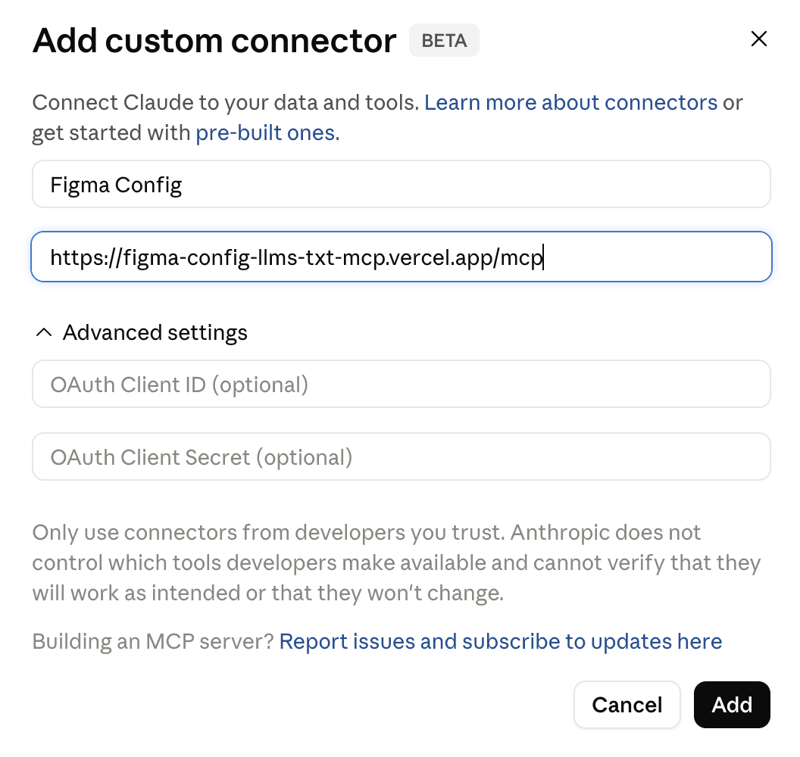
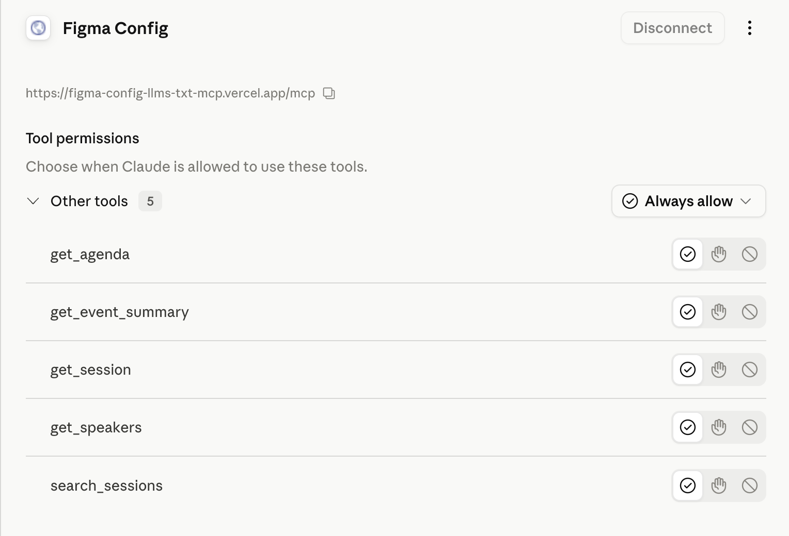
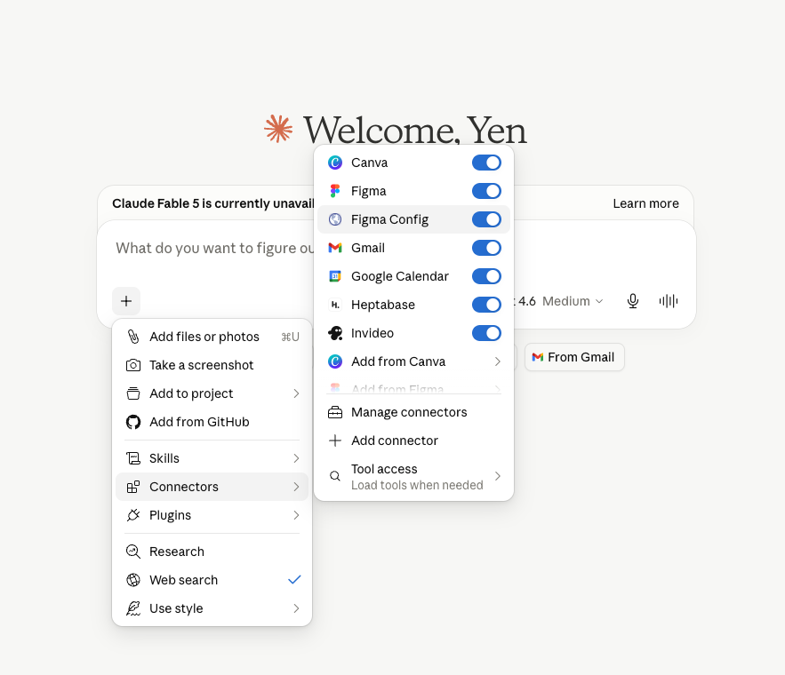
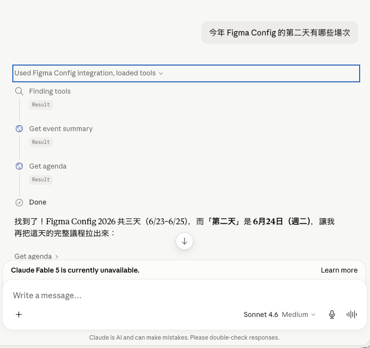

# figma-config

把 Figma Config 年會的議程、講者與場次資訊整理成 LLM 友善格式，讓你可以直接在 Claude 中查詢，或匯出成 Markdown 檔案。

## 這是什麼？

Figma Config 是 Figma 的年度設計師大會。這套工具爬取年會官方網站，把全部議程、講者資訊與場次說明整理成結構化資料，提供兩種使用方式：透過 MCP 伺服器直接在 Claude 中查詢，或用 CLI 工具把資料匯出到本地。

目前收錄 **2026 年舊金山場次**（6 月 24–25 日）的完整資料，工具設計上可沿用於未來年度。

---

## 快速開始（直接在 Claude 查詢）

### claude.ai 瀏覽器 — 免安裝

**步驟一：** 在左側導覽列點選 **Customize**



**步驟二：** 前往 **Connectors**，點選右上角 **+** 並選擇 **Add custom connector**



**步驟三：** 填入以下資訊並點選 **Add**

- **Name**：`Figma Config`（可自行取名）
- **Remote MCP server URL**：`https://figma-config-llms-txt-mcp.vercel.app/mcp`



**步驟四：** 見到此頁面代表設定成功，Claude 已取得 5 個查詢工具



### Claude Desktop / Cursor — 本地執行

在 `~/Library/Application Support/Claude/claude_desktop_config.json` 加入：

```json
{
  "mcpServers": {
    "figma-config": {
      "command": "npx",
      "args": ["figma-config-2026-mcp"]
    }
  }
}
```

> 首次使用會即時爬取年會網站（約 90 秒），之後快取 24 小時，後續查詢幾乎即時。

### 連線後可以這樣問 Claude

在對話框點選 **+** → **Connectors**，確認 Figma Config 已啟用：



直接用自然語言提問：



```
今年 Figma Config 的第二天有哪些場次？
哪些場次跟 AI 或機器學習有關？
Google 的講者有誰？
給我 Figma Config 2026 的整體摘要。
```

---

## 給開發者

### 匯出資料（CLI 工具）

```bash
npx figma-config-llms-txt
```

把所有場次、講者、議程匯出成 Markdown 和 `llms.txt` 格式，可直接貼入任何 LLM 或存成本地檔案。完整說明請見 [packages/cli](packages/cli)。

### 套件結構

| 套件 | 說明 | 文件 |
|---|---|---|
| `figma-config-2026-mcp` | MCP 伺服器（Vercel 遠端 + 本地 stdio） | [packages/mcp](packages/mcp) |
| `figma-config-llms-txt` | CLI 匯出工具 | [packages/cli](packages/cli) |
| `@yenlai/figma-config-core` | 共用爬蟲與解析器（內部使用） | [packages/core](packages/core) |

各套件均有獨立的 README，提供完整的安裝與使用說明。

---

## License

MIT
