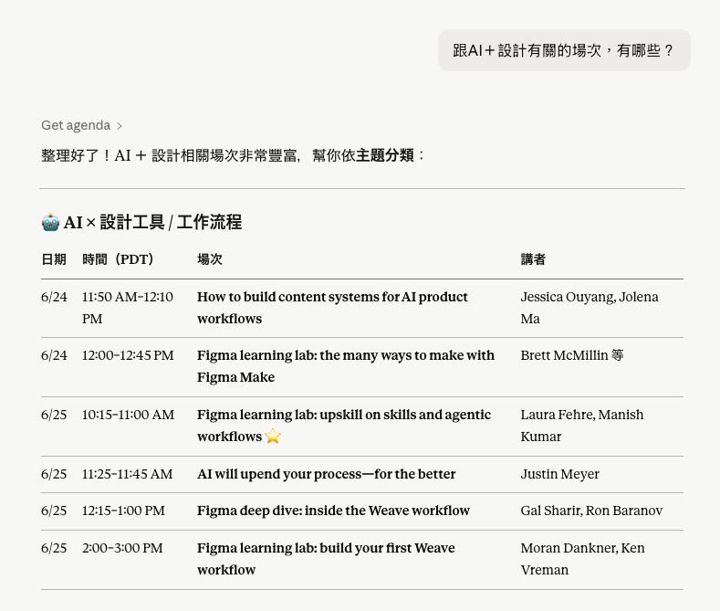
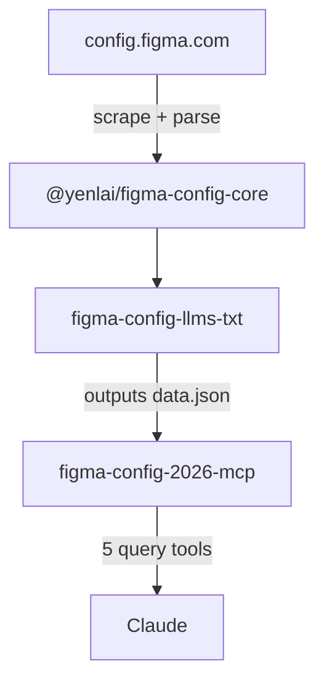

[English](README.md) | [繁體中文](README.zh-TW.md)

# figma-config

Turn Figma Config conference sessions, speakers, and agenda into LLM-friendly content — query it directly in Claude or export it as local Markdown files.


## What is this?

Figma Config is Figma's annual design conference. This toolset scrapes the official conference site and structures all sessions, speakers, and agenda data — reducing token usage and hallucination risk compared to live web fetching.

Two ways to use it:
1. **Quick use:** Connect the MCP server to Claude (browser or Desktop App) and query conference data in plain language
2. **Export:** Use the CLI tool to export data locally for further processing

Currently includes the full **2026 San Francisco event** (June 24–25).

## Features

Once connected, ask Claude anything about the conference:

```
What sessions are happening on day 2 of Figma Config this year?
Which sessions are related to AI?
What companies are the speakers from?
Who is speaking from Google?
Recommend sessions for me
```

| Connector active, query in progress | Detailed response |
|---|---|
|  |  |

## Setup

Choose the method that matches how you use Claude.
**Recommended for non-developers:** Option 1 (browser) — no local installation required.

### Option 1: Claude on the browser

| Step | Action | Screenshot |
|---|---|---|
| 1 | Click **Customize** in the left sidebar |  |
| 2 | Go to **Connectors** → click **+** → **Add custom connector** |  |
| 3 | Enter **Name**: `Figma Config` (any name works)<br>Enter **URL**: `https://figma-config-llms-txt-mcp.vercel.app/mcp`<br>Click **Add** |  |
| 4 | The tool permissions page confirms setup is complete |  |

### Option 2: Claude Desktop App (or Cursor)

Also works with Cursor and other MCP-compatible desktop clients.

Add to `~/Library/Application Support/Claude/claude_desktop_config.json`:

```json
{
  "mcpServers": {
    "figma-config": {
      "command": "npx",
      "args": ["figma-config-2026-mcp"]
    }
  }
}
```

> The first run scrapes the conference site (~90 seconds). Subsequent requests use a 24-hour local cache and respond instantly.

## For developers

This monorepo contains three packages with distinct responsibilities: scraping, data export, and query interface — each usable independently or together.



### Packages

| Package | Role | Description | Docs |
|---|---|---|---|
| `@yenlai/figma-config-core` | Core engine | Scraper, parser, formatter — shared dependency for `cli` and `mcp` | [packages/core](packages/core) |
| `figma-config-llms-txt` | Data producer | Runs the scrape pipeline, outputs `data.json`, Markdown, `llms.txt` | [packages/cli](packages/cli) |
| `figma-config-2026-mcp` | Query interface | Reads `data.json`, exposes 5 tools to Claude via MCP | [packages/mcp](packages/mcp) |

Each package has its own README with full installation and usage instructions.

## Feedback

Found a bug or have a suggestion? Open an issue on [GitHub Issues](https://github.com/laiyenju/figma-config-mcp/issues).
