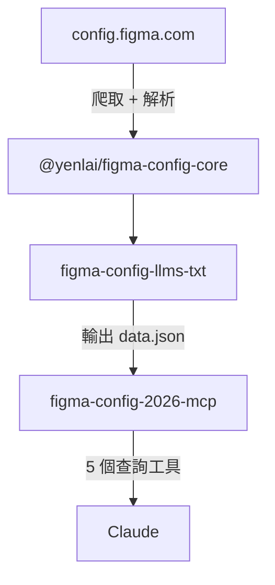

[English](README.md) | [繁體中文](README.zh-TW.md)

# figma-config

把 Figma Config 年會的議程、講者與場次資訊整理成 LLM 友善格式，讓你可以直接在 Claude 中查詢，或匯出成 Markdown 檔案。


## 這是什麼？

Figma Config 是 Figma 的設計年會。這套工具爬取年會官方網站，把全部議程、講者資訊與場次說明整理成結構化資料，節省 LLM 透過 web fetch 消耗的 token 數、避免資訊幻覺。

目前提供兩種使用方式：
1. **快速使用：** 在 Anthropic Claude 的瀏覽器或 Desktop App，完成連結 MCP 伺服器後，直接在 Claude 中查詢
2. **額外開發：** 用 CLI 工具把資料匯出到本地，做後續加工處理

目前收錄 **2026 年舊金山場次**（6 月 24–25 日）的完整資料。

## 功能特色

在 Claude 完成 MCP 伺服器連結（啟用 connector）後，依照你想查詢的資訊發問，發問範例如下

```
今年 Figma Config 的第二天有哪些場次？
哪些場次跟 AI 有關？
講者來自哪些公司？
來自 Google 的講者有誰？
請推薦適合我的場次
```

| 啟用 connector，查詢進行中 | 詳細回應呈現 |
|---|---|
|  |  |


## 如何設定

根據你使用 Claude 的習慣，分為以瀏覽器使用、以 Desktop App 使用兩種，分別有不同的設定方式。
非開發者、不想要佔用個人電腦本地端過多資料，**推薦採用【以瀏覽器使用 Claude】** 的設定方式。

### 【設定方式 1：以瀏覽器使用 Claude】

| 步驟 | 操作 | 截圖 |
|---|---|---|
| 1 | 在左側導覽列點選 **Customize** |  |
| 2 | 前往 **Connectors** → 點選 **+** → **Add custom connector** |  |
| 3 | 填入 **Name**：`Figma Config`（可自行取名）<br>填入 **URL**：`https://figma-config-llms-txt-mcp.vercel.app/mcp`<br>點選 **Add** |  |
| 4 | 見到工具權限頁面代表設定成功 |  |

### 【設定方式 2：以 Desktop App 使用 Claude 的設定方式】

此方式也適用於 cursor 等支援 Anthropic MCP 規格的其他 Desktop App

在 `~/Library/Application Support/Claude/claude_desktop_config.json` 加入：

```json
{
  "mcpServers": {
    "figma-config": {
      "command": "npx",
      "args": ["figma-config-2026-mcp"]
    }
  }
}
```

> 首次使用會即時爬取年會網站（約 90 秒），之後快取 24 小時，後續查詢幾乎即時。


## 給開發者

這個 monorepo 由三個套件組成，分工明確：爬取解析、資料匯出、查詢介面各自獨立，可單獨使用或組合運作。



### 套件

| 套件 | 角色 | 說明 | 文件 |
|---|---|---|---|
| `@yenlai/figma-config-core` | 核心引擎 | 爬蟲、解析、格式化；`cli` 與 `mcp` 共同依賴 | [packages/core](packages/core) |
| `figma-config-llms-txt` | 資料生產者 | 執行爬取流程，輸出 `data.json`、Markdown、`llms.txt` | [packages/cli](packages/cli) |
| `figma-config-2026-mcp` | 查詢介面 | 讀取 `data.json`，透過 MCP 協定提供 5 個工具給 Claude | [packages/mcp](packages/mcp) |

各套件均有獨立的 README，提供完整的安裝與使用說明。

## 回饋

發現問題或有建議？歡迎到 [GitHub Issues](https://github.com/laiyenju/figma-config-mcp/issues) 開 issue。
